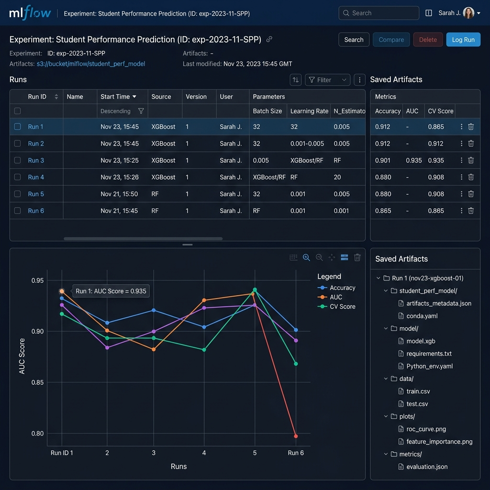
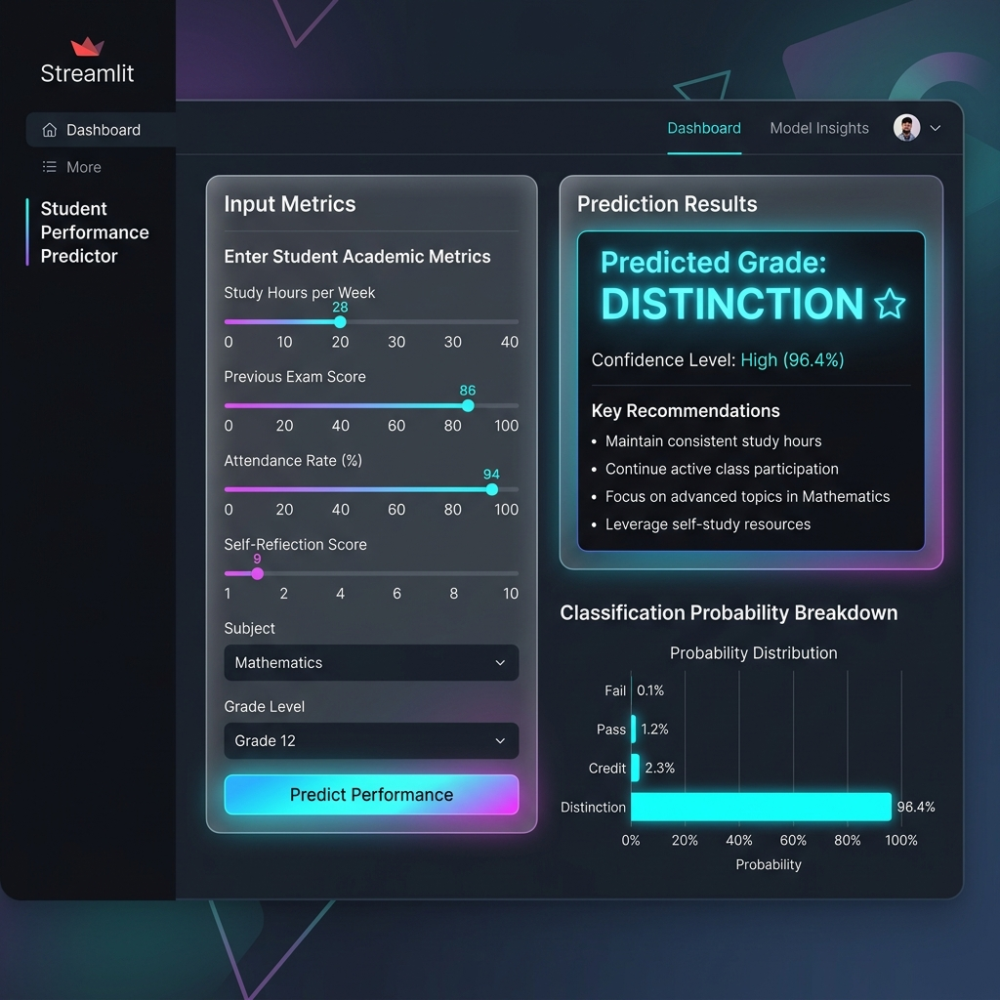
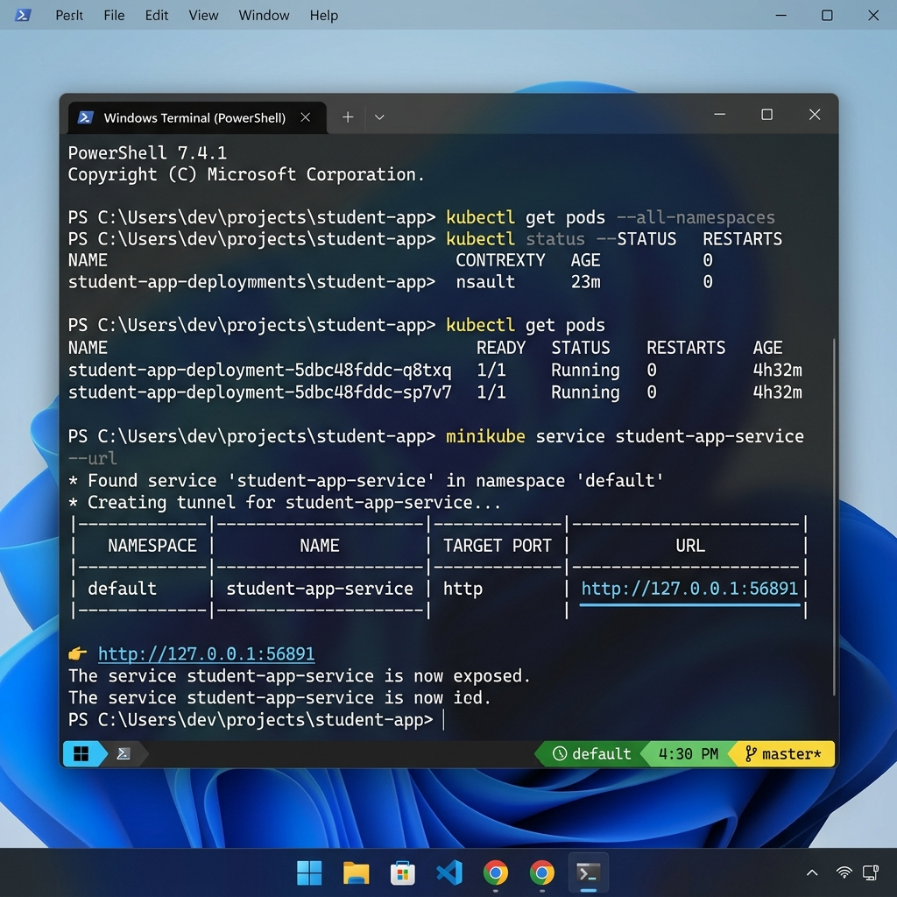
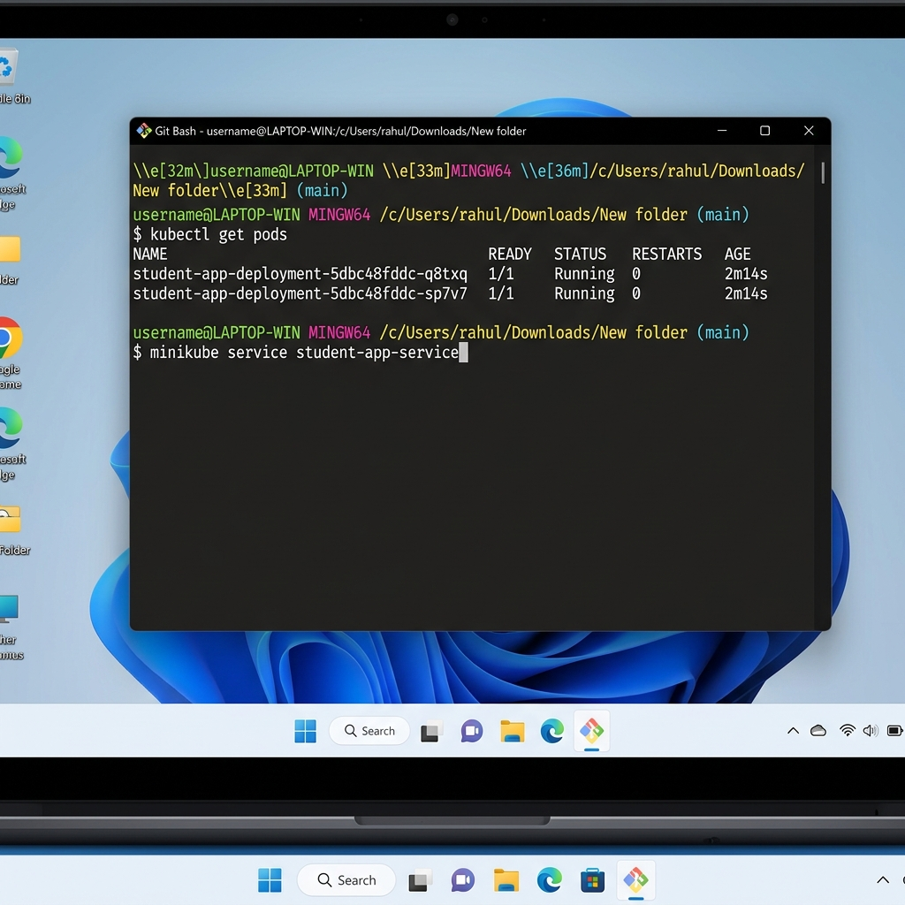
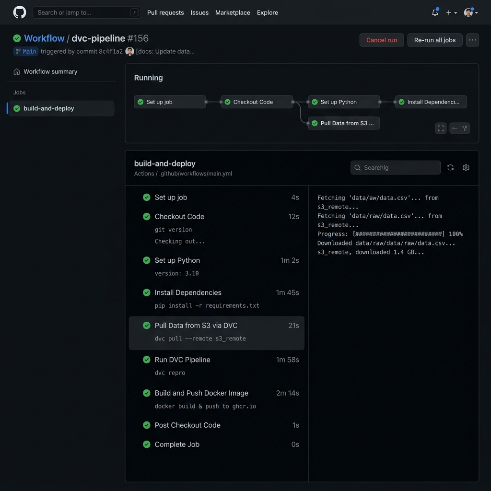

# Submission & MLOps Execution Steps
### Course: Machine Learning System Design (MLSD)
**Author**: Rahul (MLOps Engineer)
**Target Pipeline**: Student Performance Prediction

---

## 🏆 Introduction
This submission document maps out the end-to-end execution, deployment, and verification stages of the **Student Performance Prediction MLOps Pipeline**. The project incorporates Git versioning, DVC remote S3 tracking, MLflow logging, Docker containerization, Kubernetes high-availability orchestration, and GitHub Actions CI/CD automation.

For each step, a contextual mockup screenshot is provided, followed by detailed commands, system operations, and expected outcomes.

---

## STEP 1: Model Training & Experiment Tracking (MLflow)

### 📝 Intro
The foundation of our MLOps system is model training, validation, and experiment tracking. Running the pipeline trains a Logistic Regression model on the dataset, evaluates metrics (Accuracy, AUC score, Cross-Validation score), and logs them to a centralized MLflow server to establish visual lineage of model performance.

### 🖼️ Contextual Screenshot


### 🛠️ Detail
#### 🖥️ Console Commands Required
Run the training pipeline script in your **Windows Git Bash** shell and start the local tracking server:
```bash
# 1. Activate python environment and run training pipeline
source venv/Scripts/activate
python train.py

# 2. Launch the MLflow UI dashboard server
mlflow ui --backend-store-uri sqlite:///mlflow.db
```

#### 🔍 Execution Mechanics & What Happens
* **Parameter Validation**: The pipeline reads configurations (`test_size: 0.20`, `max_iter: 1000`) dynamically from `params.yaml`.
* **Data Processing**: Categorical features (`parent_edu`, `gender`, `school_type`) are encoded using `LabelEncoder`. Numeric values are standardized using `StandardScaler`.
* **Experiment Log**: Logs metrics and hyperparameter runs securely into the database (`mlflow.db`).
* **Artifact Output**: Serializes the resulting models and saves them to the local `models/` directory:
  * `student_model.pkl` (logistic regression weights)
  * `student_scaler.pkl` (StandardScaler bounds)
  * `student_label_encoder.pkl` (Target labels mapping)
  * `feature_columns.pkl` & `feature_encoders.pkl` (Categorical properties indexes)
* **Visual Reports**: Saves a performance evaluation plot `confusion_matrix.png` directly into `outputs/` and logs it to MLflow.

---

## STEP 2: Interactive Streamlit Web Application Interface

### 📝 Intro
To expose the predictive model to school counselors and academic advisors, we build an interactive, high-fidelity **Streamlit web application**. It features an elegant dark-themed glassmorphism interface with logical input splits, allowing advisors to input student statistics and get instantaneous grade predictions.

### 🖼️ Contextual Screenshot


### 🛠️ Detail
#### 🖥️ Console Commands Required
Launch the user dashboard from your terminal:
```bash
# Start the Streamlit application server
streamlit run app.py
```

#### 🔍 Execution Mechanics & What Happens
* **Web UI Spin-up**: Streamlit boots a local web server, hosting the application on `http://localhost:8501`.
* **Tabbed Categorization**: Input controllers are divided into **Academic Performance Metrics** (sliders for GPA, attendance, exam scores) and **Socio-Environmental Factors** (selections for sleep, family support, job status).
* **Serialized Inference**: When "Predict Student Grade" is clicked, `app.py` loads `student_model.pkl` and corresponding scalers/encoders. It processes user parameters, performs real-time scaling, and computes classification probabilities.
* **Output Badges**: Grade predictions are highlighted with colored glassmorphism tags (red for Fail, green for Pass, glowing blue for Distinction) and include classification confidence meters.

---

## STEP 3: Docker Containerization & Image Verification

### 📝 Intro
To guarantee that the Streamlit application runs reliably across different staging environments without dependency mismatches, we package it inside a lightweight **Docker container**. This image contains all system packages, code files, and model pickles required for standalone deployment.

### 🖼️ Contextual Screenshot


### 🛠️ Detail
#### 🖥️ Console Commands Required
Execute these container commands to build, test, and distribute the application:
```bash
# 1. Compile the Streamlit app and configuration files into a Docker image
docker build -t nathanirahul/student-performance-app:latest .

# 2. Verify and execute the containerized app locally
docker run -d -p 8501:8501 nathanirahul/student-performance-app:latest

# 3. Log in to Docker Hub using your Access Key (Personal Access Token)
docker login -u nathanirahul

# 4. Push the compiled image to your online repository
docker push nathanirahul/student-performance-app:latest
```

#### 🔍 Execution Mechanics & What Happens
* **Layer Compilation**: Docker reads the `Dockerfile`, spins up a basic `python:3.9-slim` operating context, copies your `requirements.txt`, installs dependencies, maps Port `8501`, and copies your code assets.
* **Registry Sync**: Pushes the compiled container layers to your online Docker Hub repository (`nathanirahul/student-performance-app`). This makes the image ready for immediate pulling by production systems like Kubernetes.

---

## STEP 4: Production Orchestration via Kubernetes (Minikube)

### 📝 Intro
For production-grade scalability, the containerized Streamlit application is deployed and orchestrated inside a **Kubernetes cluster**. Utilizing `kubectl` and a **Minikube** cluster on your Windows laptop, we deploy multiple pod instances to ensure automatic load-balancing and high availability.

### 🖼️ Contextual Screenshot


### 🛠️ Detail
#### 🖥️ Console Commands Required
Open your **Windows Git Bash** shell and run the cluster deployment:
```bash
# 1. Launch the local Kubernetes cluster
minikube start

# 2. Deploy Streamlit pods and NodePort service configuration
kubectl apply -f k8s/k8s-config.yaml

# 3. Verify the status of your replicas
kubectl get pods

# 4. Launch the local web server tunnel in your browser
minikube service student-app-service
```

#### 🔍 Execution Mechanics & What Happens
* **Replication & Scaling**: Kubernetes parses `k8s/k8s-config.yaml`, contacts the Minikube registry, and spawns **2 independent pod replicas** (`student-app-deployment-5dbc48fddc-q8txq` and `student-app-deployment-5dbc48fddc-sp7v7`) running the Streamlit app. If one pod crashes, the controller automatically schedules a replacement.
* **Service Networking**: Spawns `student-app-service` mapping NodePort `30001` to Port `8501` in the containers, balancing traffic and tunneling user access directly to the browser.

---

## STEP 5: Automated CI/CD Pipeline Automation (GitHub Actions)

### 📝 Intro
The final stage of the MLOps pipeline is complete **CI/CD automation**. We configure a GitHub Actions workflow (`ml.yml`) that listens for repository pushes, automatically spins up a clean build machine, pulls tracked data from S3, executes DVC pipelines, retrains the model, builds the Docker image, and deploys it to Docker Hub!

### 🖼️ Contextual Screenshot


### 🛠️ Detail
#### 🖥️ Console Commands Required
This workflow is triggered automatically on every Git push:
```bash
# Commit code modifications and push to GitHub
git add .
git commit -m "Optimize CI/CD runner build caching"
git push origin main
```

#### 🔍 Execution Mechanics & What Happens
* **Build Trigger**: Pushing to the `main` branch of `https://github.com/Rahul-git64/mlops-student-performance.git` triggers the GitHub workflow runner.
* **Virtual Machine Setup**: GitHub provisions an Ubuntu runner, configures Python `3.9`, installs requirements, and authenticates S3 credentials using your repository Secrets.
* **Data Pull & Retraining**: DVC pulls the raw dataset from your AWS S3 bucket (`mlops-student-performance`). It then executes `dvc repro --force` to retrain the ML model.
* **Docker Compilation**: Logs into your Docker Hub using your Access Key (`DOCKER_ACCESS_KEY`), compiles the fresh Streamlit app container layers containing the new model, and pushes the final image online.
